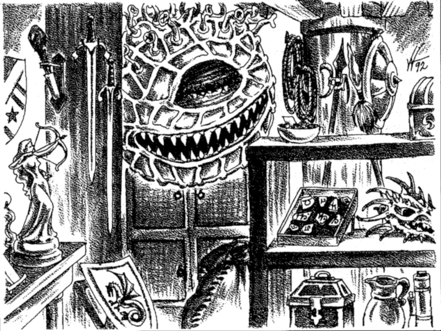

&nbsp;

Sklep Starego Xobloba to sklep zajmujący się handlem rozmaitymi dziwactwami , zlokalizowany w Dzielnicy Portowej przy skrzyżowaniu drogi Zastrow z Aleją Fileta. Najbardziej znany z wypchanego Beholdera podwieszonego nad ladą.

&nbsp;

